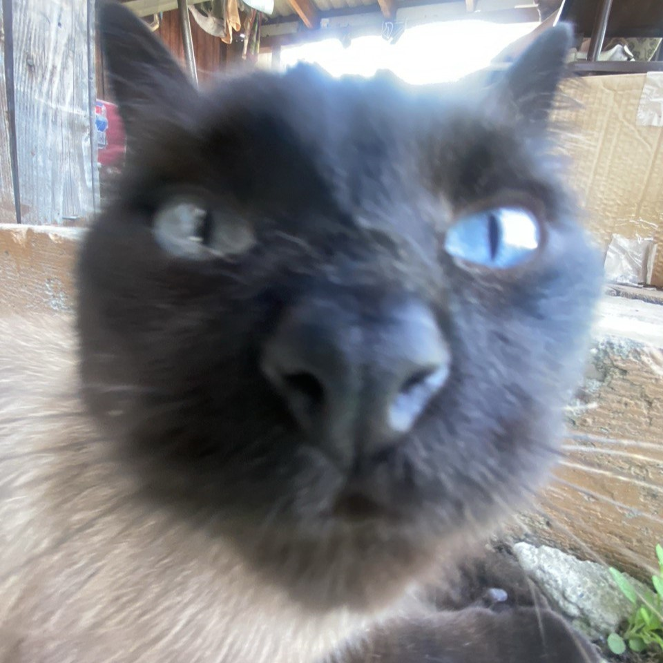

# Немного обо мне

Привет каждому, кто нашёл этот сайт. Здесь будет немного информации обо мне, начнём! 

## Кто я?

Меня зовут **Виолетта**, мне 22 года. Эта страничка была создана в рамках выполнения домашнего задания от Нетологии. Кстати, я обучаюсь на их курсе _[Тестировщик ПО](https://netology.ru/programs/qa#/ "Ссылка на курс")_ и мне очень нравится обучение здесь, хоть я и достаточно сильно отстала от программы (но надеюсь наверстать!). 

Это я :)

Я обожаю слушать музыку, но мои вкусы довольно специфичны. Если захотите ознакомиться с ними, то вот ТОП-5 моих любимых исполнителей за 2023 год (по данным Яндекс.Музыки):
* [Pyrokinesis](https://music.yandex.ru/artist/5313769)
* [КУОК](https://music.yandex.ru/artist/6347797)
* [Loqiemean](https://music.yandex.ru/artist/4545156)
* [МУККА](https://music.yandex.ru/artist/6928538)
* [Три дня дождя](https://music.yandex.ru/artist/8095900)

Но больше всего мне нравятся песни, строки которых можно использовать как отдельные цитаты, например: 
>Но есть у человека кое-то и это - выбор  
Выбор полюбить, выбор умереть, быть или не быть  
Сохранить холод или погореть

## Образование ~~и планы на жизнь~~
Летом 2022 года я окончила ***[Томский государственный университет систем управления и радиоэлектроники](https://tusur.ru/ru)*** по специальности "Прикладная информатика в экономике". И после выпуска не понимала, куда пойти, куда податься, потому что связывать свою дальнейшую деятельность с полученной профессией совершенно не хотелось. 

И тогда, в попытках понять, что же мне интересно из IT-сферы, я узнала о профессии <u>тестировщика</u> и поняла, что мне это интересно и я хочу попробовать себя в этом

Надеюсь, что всё получится 🎉

## Про котиков

У меня есть котик по кличке Люций (сокращенно от Люцифер 😈) Вот его смешная фоточка ⬇️

**Топ-3 причины любить котиков:**
1. Они мурчат
2. Они красивые
3. Они никогда не предадут

Теперь опрос, выберите опцию:
- [x] Любить котиков
- [ ] Не любить котиков

## КОНЕЦ
Спасибо, что посмотрели этот сайт 

